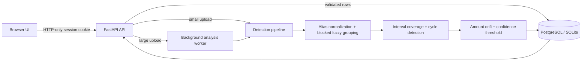

# Architecture

Large uploads leave the request lifecycle through FastAPI background dispatch. For horizontal multi-instance production, replace that adapter with a durable queue such as Celery/Redis without changing `run_analysis`.
